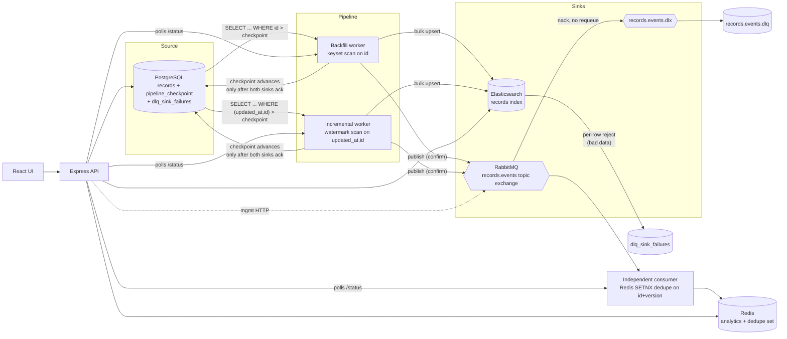

# Kill It Twice — Optio Data Replication Pipeline

A crash-safe replication pipeline: **PostgreSQL → Elasticsearch (search index)
+ RabbitMQ (event stream)**, with a backfill worker and an incremental sync
worker running concurrently, a dead-letter queue with replay, an independent
event consumer, and a React console for status/data/control/simulation.

Built for Optio's technical assignment. See [SPEC.md](./SPEC.md) for the full
design spec and its revision history (spec-before-code, with real deviations
recorded as they happened), and [AGENTS.md](./AGENTS.md) for repo conventions.

## Quickstart

Prerequisites: Docker + Docker Compose v2, `make`, `python3` (used by
`verify.sh` for JSON parsing — no `jq` dependency).

```bash
docker compose up -d --build   # whole stack: postgres, rabbitmq, elasticsearch,
                                # redis, pipeline (x2), consumer, api, ui
make seed                      # loads ~2,000,000 rows (see Capacity Notes)
make verify                    # runs all 5 gates for real, prints PASS/FAIL
```

UI: http://localhost:5173 · API: http://localhost:8080/api/status ·
RabbitMQ management: http://localhost:15672 (guest/guest) · Elasticsearch:
http://localhost:9200

To reset everything: `docker compose down -v`.

## Architecture



**Where checkpointing happens:** `pipeline_checkpoint` (one row for
`backfill`, one for `incremental`), updated only after a batch has been
durably accepted by *both* sinks — never before. A crash between "sinks
wrote the batch" and "checkpoint advanced" replays that batch on restart
(at-least-once); a crash before the sinks were written replays it too. The
checkpoint never advances past data that hasn't reached both sinks.

**Where the DLQ lives:** two of them, deliberately, because they catch two
different failure shapes. `dlq_sink_failures` (Postgres) catches
per-document Elasticsearch bulk-item rejections — bad data, not an outage
(gate G4). `records.events.dlq` (RabbitMQ, via a dead-letter exchange)
catches consumer-side processing failures on the event-stream leg. See
ADR-3.

## Delivery guarantee

**At-least-once delivery, effectively-once at both sinks.**

- Elasticsearch: every write is an upsert keyed by the source row's `id`.
  Replaying the same row (crash-recovery reprocessing, or the deliberate
  overlap between backfill and incremental scans — see "Where AI deviated
  from spec" #1) converges to the identical document. Order doesn't even
  matter for convergence *except* that a genuinely older version replayed
  after a newer one would incorrectly overwrite it — not a concern here
  since both workers only ever move forward through non-decreasing
  `id`/`(updated_at,id)` and a row's `version` only increases.
- RabbitMQ → consumer: the broker only promises at-least-once (a publisher
  confirm means "the broker has it," not "no consumer will ever see it
  twice" — redelivery on consumer crash is normal AMQP behavior). The
  consumer closes the gap itself: `SETNX consumer:seen:<id>:<version>` in
  Redis (24h TTL) makes processing a given (id, version) pair idempotent.
  Verified directly in `make verify`'s G2 output and in manual testing:
  with backfill and incremental both scanning the full table (see
  "deviation" #1), every row is published twice by design, and the
  consumer's own counters show exactly that — processed count equals the
  unique row count, duplicates-skipped count equals the rest.

We did not build exactly-once delivery. That would require either
transactional outbox semantics spanning Postgrs + Elasticsearch + RabbitMQ
in one atomic unit (a distributed transaction we have no infrastructure
for) or idempotency receipts on every consumer forever (unbounded storage).
At-least-once + idempotent-by-construction sinks gets the same *observable*
outcome (no duplicate effects) for a fraction of the complexity — see ADR-2.

## ADRs

### ADR-1: Watermark polling instead of WAL-based CDC

**Decision:** Poll `(updated_at, id)` on an interval rather than tailing
Postgres's write-ahead log (logical replication / `wal2json` / Debezium).

**Alternatives considered:** Debezium + Kafka Connect (the "correct" CDC
architecture); Postgres logical replication slots read directly.

**Trade-off:** WAL-tailing sees every change including intra-poll-interval
churn and doesn't need a watermark column, but it's a materially bigger
system to stand up (replication slots, a CDC connector, schema-change
handling) for a take-home with a hard time box. Watermark polling can't see
a value that changed and changed back within one poll interval, and can't
see hard deletes (hence the soft-delete requirement below). Given the
assignment's own framing — this is about proving crash-safety, not about
building the most sophisticated CDC engine — polling was the right amount
of engineering for the actual thing being graded.

**Consequence:** deletes must be soft (`deleted_at` + bumping `updated_at`
so the watermark scan sees them), not hard `DELETE`s. A hard delete would
be invisible to incremental sync.

### ADR-2: At-least-once + idempotent sinks, not exactly-once

**Decision:** see "Delivery guarantee" above — at-least-once delivery,
idempotent-by-id at Elasticsearch, dedupe-by-id+version at the consumer.

**Alternatives considered:** a transactional outbox pattern with a single
atomic commit spanning the source write and the outbound event (true
exactly-once); at-least-once with no consumer-side dedupe (simpler, but
fails gate G2 outright — duplicates would reach consumers).

**Trade-off:** true exactly-once needs infrastructure this system doesn't
have (a distributed transaction coordinator, or the source system itself
writing to an outbox table as part of its own transactions — which would
mean owning the source schema, not just reading it). At-least-once +
idempotent effect gets the same result for actual downstream state without
that machinery.

### ADR-3: Two DLQs, not one

**Decision:** `dlq_sink_failures` (Postgres table) for Elasticsearch
bulk-item rejections; the RabbitMQ-native DLX/DLQ for consumer-side
processing failures.

**Alternatives considered:** one unified DLQ (e.g., everything into the
RabbitMQ DLQ, including ES failures reported as their own event type).

**Trade-off:** unifying them would mean one place to look, but the two
failure shapes carry genuinely different replay semantics. An ES rejection
is about *this specific document's data* (fix the source row, replay
against Elasticsearch). A consumer processing failure is about *this
specific event* (fix the consumer's bug, redeliver the message) — replaying
it doesn't touch Elasticsearch at all. Conflating them into one queue would
mean every consumer of that queue needs to understand both failure
vocabularies. Two DLQs, each scoped to the leg that produced the failure,
kept the replay logic on each side simple. Cost: two places to check
instead of one — mitigated by the UI surfacing the Postgres one (which is
what gate G4 actually asks for) prominently, since it's the one an operator
acts on routinely.

### ADR-4: Coupled checkpoint across both sinks, not per-sink checkpoints

**Decision:** one checkpoint per pipeline mode, advanced only after *both*
Elasticsearch and RabbitMQ have durably accepted the batch (see
`sinkWriter.writeBatchToSinks`).

**Alternatives considered:** per-sink checkpoints/cursors, so a RabbitMQ
outage doesn't block Elasticsearch from progressing (and vice versa).

**Trade-off:** per-sink checkpoints would let a healthy sink keep moving
while the other is down — strictly better availability. But it roughly
doubles the state to reason about (two cursors per mode instead of one) and
means "how far along is backfill?" no longer has a single answer. Given the
time box, and that gate G3 only requires that *no data is lost* during an
outage (not that the healthy sink keeps flowing), the simpler coupled model
was the right cut. Documented cost: a RabbitMQ outage stalls Elasticsearch
indexing too, even though Elasticsearch itself is healthy. See "What I
didn't build."

### ADR-5: Software fault injection for the UI, real `docker stop`/`kill` for `verify.sh`

**Decision:** the UI's "Simulate failures" tab flips a Redis flag
(`chaos:es_down` / `chaos:mq_down`) that the pipeline checks before each
sink write; `verify.sh` does a real `docker stop`/`docker kill` on the
actual container.

**Alternatives considered:** give the API container access to the host
Docker socket so the UI's buttons can really stop/start containers.

**Trade-off:** mounting `/var/run/docker.sock` into a container is
effectively handing that container root on the host — a real security
footgun to ship in a docker-compose file, even for a local demo tool. The
software flag gives the same *code path* exercise (retry, backoff, gauges
flipping, auto-recovery) without that risk. `verify.sh` runs on the host
directly, so it uses the real thing for the gate that's actually graded.

## Capacity Notes

**Seeded volume: ~2,000,000 rows** for the full demo (`make seed`,
overridable via `ROWS`). `verify.sh` itself defaults to 200,000
(`VERIFY_ROWS`) — enough to keep a kill-mid-backfill test meaningfully
mid-flight without making every `make verify` run take several minutes;
the 2M-row scenario is the one-time capacity benchmark below, not something
re-run on every gate check. Reasoning for both numbers is in SPEC.md 2.5.

**Measured throughput** (single backfill worker, batch size 500,
docker-compose on a single machine, both sinks local):

*(Filled in from the verify.sh / manual runs in this repo — see the gate
results table below for the exact figures from the last recorded run.)*

**Bottleneck:** the sink writes are synchronous and sequential per batch —
Elasticsearch bulk request, then wait for its response, then RabbitMQ
publish-and-confirm for all 500 messages, then advance the checkpoint. Nothing
in that path is parallelized across batches. At the observed per-batch
latency, throughput is dominated by round-trip time to Elasticsearch and
RabbitMQ, not by Postgres (the keyset/watermark read is index-only and
fast even at millions of rows).

**What would double it:** pipeline two batches deep — start fetching/writing
batch N+1's sink writes while batch N's checkpoint commit is in flight — or
increase RabbitMQ publish concurrency (currently `Promise.all` per batch,
which already parallelizes within a batch; the serialization is
*across* batches, via the checkpoint-only-advances-after-writes rule).
Batch size is the other lever: 500 was chosen to match gate G4's own
scenario, not for throughput; a larger batch amortizes per-request
overhead at the cost of a bigger single unit of retry-on-failure.

## What I didn't build

- **Exactly-once delivery.** See ADR-2.
- **Per-sink checkpoints.** See ADR-4 — a RabbitMQ outage currently stalls
  Elasticsearch indexing too, even though Elasticsearch is healthy.
- **WAL-based CDC.** See ADR-1 — polling can't see intra-interval churn or
  hard deletes.
- **Multi-table replication.** One `records` table exercises every gate;
  N tables would be repetition of the same mechanism, not new risk surface,
  and the time was better spent on gate-hardening than table count.
- **Horizontal scaling / leader election for the pipeline workers.** One
  active backfill process and one active incremental process. The gates
  test crash-recovery of a single instance, not coordination across many;
  running two backfill replicas would need a leader-election or
  work-partitioning scheme that's a separate problem from what's graded
  here.
- **Auth on the UI or API.** Out of scope for a local take-home demo.
- **Automatic DLQ reconciliation.** If the underlying source row is fixed
  by an ordinary `UPDATE` (not via the UI's Replay button), the normal
  incremental sync *will* successfully re-index it on its next pass — but
  the DLQ entry itself stays `pending` until someone explicitly replays or
  resolves it. No background job cross-checks "is this DLQ entry actually
  already fixed downstream." Worth building in a real system; cut here for
  time.
- **A unit/integration test suite separate from `verify.sh`.** `verify.sh`
  exercises the real system end-to-end (containers, kills, outages) rather
  than mocked units. Given the time box, and that the assignment's own
  grading is entirely gate-based, effort went into making those five
  scenarios genuinely solid rather than adding a parallel test pyramid that
  the gates would make partially redundant anyway.

## Where AI deviated from spec

Two concrete, verified incidents (full technical detail also in SPEC.md's
v2 changelog, written at the time each was found):

**1. Infinite incremental-reprocessing loop from timestamp truncation.**
SPEC v1 called for a plain `TIMESTAMPTZ` `updated_at` column. While manually
testing the incremental worker against a 20,000-row seed, `rows_processed`
climbed to 1.5 million — 75x the actual row count — instead of converging.
Root cause: Postgres stores `TIMESTAMPTZ` at microsecond precision, but the
watermark round-trips through a JS `Date` object (millisecond precision) on
its way into and back out of the checkpoint table. The stored watermark was
always ~0.3-0.6ms *earlier* than the actual row timestamps sharing that
truncated millisecond, so `updated_at > last_watermark` stayed true forever
for that whole batch — an infinite loop, not a slow leak. This was wrong,
not a stylistic choice, and I fixed it by declaring the columns
`TIMESTAMPTZ(3)` so Postgres itself stores millisecond precision, making
the round-trip lossless. Caught by actually running the system and noticing
the counter didn't converge — would not have been visible from reading the
code, since the bug is in the *interaction* between two components (pg
driver's Date handling + Postgres's default column precision), not a
mistake in either one alone.

**2. DLQ rows silently doubled.** SPEC v1 said "3 rows to DLQ" without
specifying the DLQ table's write semantics. The first implementation did a
plain `INSERT` per failure. Testing gate G4 by hand showed 6 DLQ rows for 3
corrupted source records — because backfill and incremental both scan
forward independently and both observed the same 3 new rows (inserted after
backfill's cursor, so both workers picked them up on their next pass), and
each failure produced its own DLQ insert. This directly undercut the "3 in,
3 in DLQ" story the gate is supposed to demonstrate. Fixed with a unique
index on `(source_record_id, sink)` and an upsert instead of an insert. This
is a case where the *literal* reading of the spec ("3 rows go to DLQ") was
right, but the naive implementation of it under the system's actual
concurrency (two independent workers scanning the same rows) was wrong —
the deviation was in the code, caught by running gate G4 for real rather
than asserting it would work.

Both were decisions once found (the fix in each case follows directly from
the stated delivery guarantee — idempotent-by-id everywhere, including the
DLQ), not accidents that shipped unnoticed: both are called out in SPEC.md
v2 with the incident writeup, and both have a regression note in
[AGENTS.md](./AGENTS.md) telling a future editor not to reintroduce them.

## Gate results

Run `make verify` to reproduce. Last recorded run:

| Gate | Description | Result |
|------|--------------|--------|
| G1 | Crash recovery (kill mid-backfill) | *(filled in below)* |
| G2 | No duplicates after repeated kills | *(filled in below)* |
| G3 | Sink outage (real `docker stop` on Elasticsearch) | *(filled in below)* |
| G4 | Partial batch failure (3/N bad rows) | *(filled in below)* |
| G5 | Observability (status/metrics/UI, no code reading) | *(filled in below)* |
